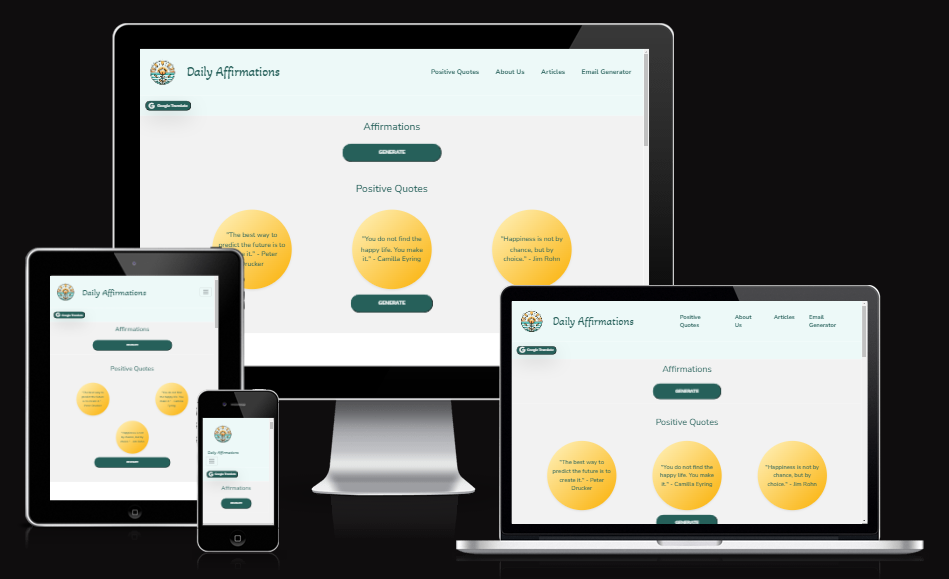
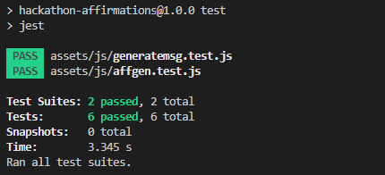
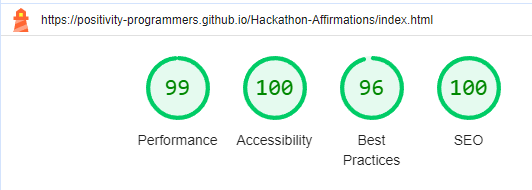
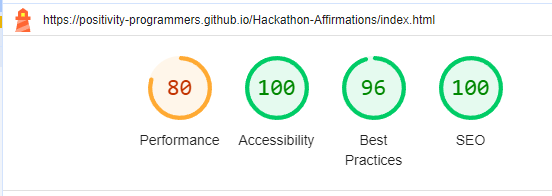
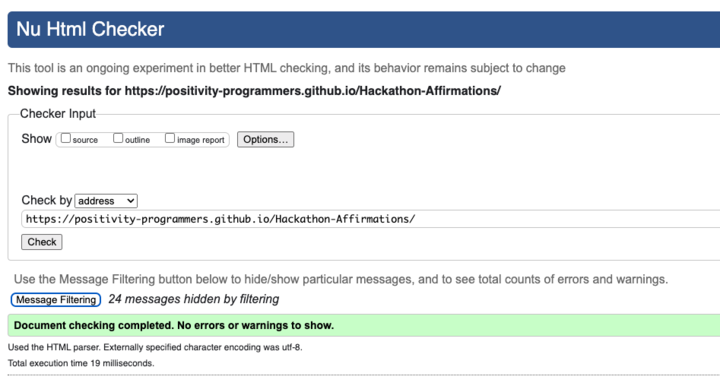
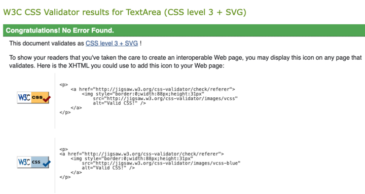
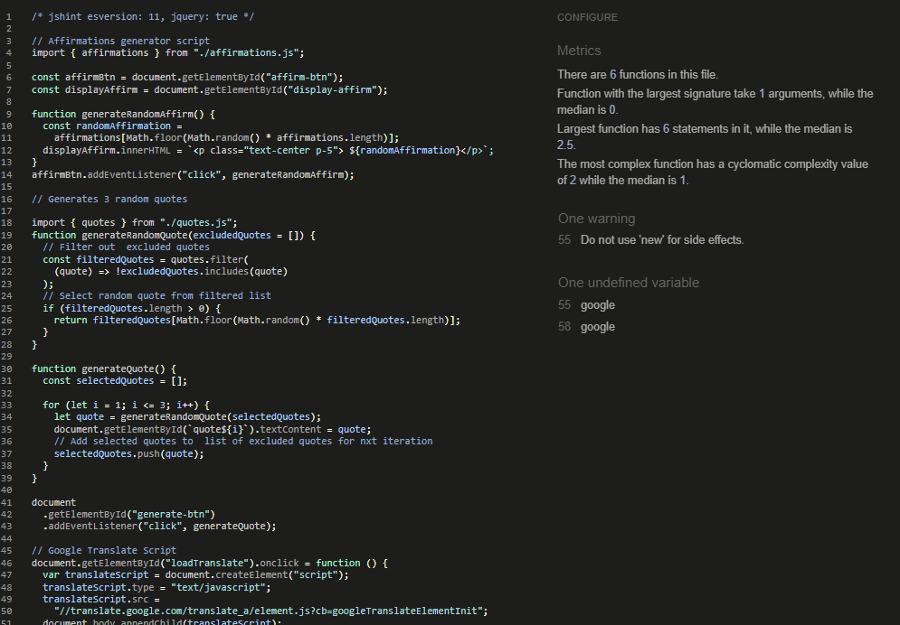
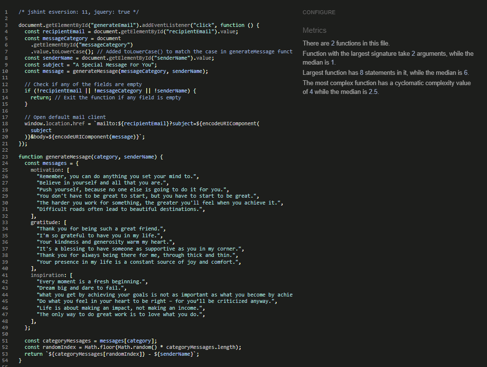

<h1 align="center"><strong> :smiley: World Happiness Day! :smiley: </strong>

</h1>

# [Daily Affirmations](https://positivity-programmers.github.io/Hackathon-Affirmations/)

A Responsive Application for users to View Daily affirmations, Positive quotes, Well Being Articles and Generate Mindful Emails.

**A March 2024 CodeInstitute Hackathon Project**

HTML / CSS / Javascript / Bootstrap

**By Positivity Programmers**

# SUBMISSION
## Deployment
The project is deployed with Git Pages and can be accessed at [Daily Affirmations](https://positivity-programmers.github.io/Hackathon-Affirmations/).

# Deployment & Local Development
## Deployment
The website was deployed to GitHub pages via the following steps:
1. Log in (or sign up) to Github
2. Go to the repository for this project
3. Click settings 
4. Under code and automation, click pages
5. Select main branch
6. Click save

## Local Development
### How to Fork
To fork the repository:
1. Log in (or sign up) to Github
2. Go to the repository for this project
3. Click the Fork button in the top right corner

### How to Clone
To clone the repository:
1. Log in (or sign up) to Github
2. Go to the repository for this project
3. Click on the code button, select whether you would like to clone with HTTPS, SSH or GitHub CLI
4. Copy the link shown
5. Open the terminal in your code editor and change the current working directory to the location you want to use for the cloned directory
6. Type 'git clone' into the terminal 
7.  Paste the link you copied in step 3
8. Press enter

## Criteria
Our team addressed the applicable criteria with innovative solutions:

- Use of **Bootstrap** to ensure a responsive and engaging design.
- Effective planning with **GitHub Projects** and documentation in **README.md**.
- Aligns with the Hackathon theme through innovative features that promote happiness and well-being. As well as featuring Google page translation, 
So we can spread happiness to all friends around the world.
- Demonstrates responsiveness, accessibility and has undergone testing across devices and browsers, As well as Jest & Light house testing.
- Introduced innovative features like the **Mindful Email Generator** and **Affirmations Generator**.
- Emphasized collaborative effort with active participation from all team members, showcasing high-quality code and inclusive practices.

# ABOUT SUBMISSION
## Intro
In an era overshadowed by the hustle of daily life, our project serves as a beacon of positivity. Inspired by the global pursuit of happiness, it offers a platform for daily affirmations, well-being tips, and spreading kindness. It emphasizes mindfulness, gratitude, and connection, empowering users to share and discover joy. This application is more than technology; it's about building a community that values happiness and well-being.

## Goal
Our goal is to provide a sanctuary where individuals can cultivate happiness and well-being through daily affirmations, positive quotes, and mindfulness practices. We aim to:

- Address the need for a positive mental health resource in the digital age.
- Offer accessible tools for cultivating gratitude and mindfulness.
- Engage a broad audience seeking to enhance their mental well-being.
- Benefit users by fostering a positive outlook and a supportive community.

## Tech
The project leverages a modern tech stack:

- **Frontend**: HTML5, CSS3 with Bootstrap for responsive design, and vanilla JavaScript for interactive elements.
- **Deployment**: Hosted on GitHub Pages for global accessibility.
- **Tools**: GitHub for version control and collaboration, and Google Fonts for typography.

## Testing

**Jest**

**Lighhouse Desktop**

**Lighthouse Mobile**

**Validation**

In a scenario in which we had more time, We would have liked to test more comprehensively.

## Technologies Used

* HTML5 - Delivers the structure and content for the website
* CSS3 - Provides the styling for the website
* VS Code - Used to develop the website
* JavaScript - Provides functionality for the website
* Gitbash - Terminal used to push changes to the GitHub repository
* GitHub - Used to host and deploy the website
* Chrome Dev Tools - To troubleshoot and test features, solve issues with responsiveness and styling
* [Wave Accessibility](https://wave.webaim.org/) tool was used throughout development and for final testing of the deployed website to check for any aid accessibility testing
* [Favicon Generator](https://favicon.io/) - Used to create the favicon for the website
* [Am I Responsive](http://ami.responsivedesign.is/) - To show the website image on a range of devices
* Jest for testing Javascript
* Google Translate to translate page

## Credits
Special thanks to:

- **CodeInstitute** for organizing the Hackathon.
- **Pexels** for providing high-quality images.
- **FontAwesome** for the icons used by the application.
- Every team member for their dedication, creativity, and hard work.